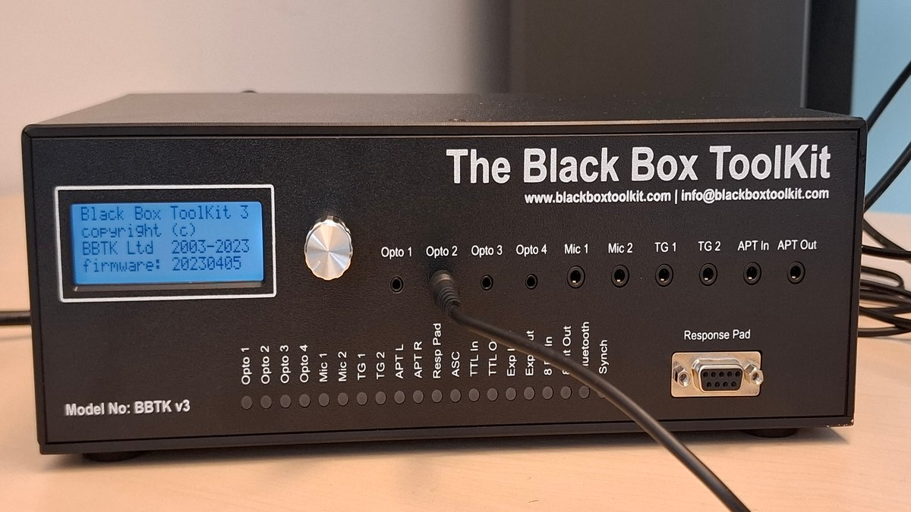

Events capture with a Black Box ToolKit 
=======================================


Here, we provide:

- a *bbtkv3* Go module which encapsulates some of
the commands documented in *The BBTKv2 API Guide* sold by the parent
company.
- an execuctable program, `bbtk`, that launches the acquisition of events on the bbtkv3 and saves them in a csv file.


| :exclamation: This is a **Work In Progress**. |
|-----------------------------------------------|

The program may not work as advertised, the documentation may not be up to date, etc.  You can contribute by reorting issues, either by contacting me (`<christophe@pallier.org>`) or by opening an issue on the [github bbtkv3 repository](http://github.com/chrplr/bbtkv3).

# Principle of operation



The **Black Box ToolKit v3** is a device that allows psychologists to
 measure the timing of audio-visual stimuli with sub-millisecond
 accuracy. It replaces a digital oscilloscope (capturing activity on
 sound and visual sensors, or TTL signals) and a signal generator
 (generating sound or TTL signal). (See
<https://www.blackboxtoolkit.com/bbtkv3.html for more information>)

To operate, three pieces of equipement are needed:

1. A stimulation device (typically a computer, but not necessarily) 
2. The bbtkv3 with input sensors (photodiodes, sound detectors, TTL detectors) attached to the stimulation device.
3. A host computer driving the bbtkv2 (hooked to it via a USB cable).

| :point_up:  The stimulation PC and the host PC *can* be the same computer |
|---------------------------------------------------------------------------| 

As data are recorded asynchronously by the BBTKvr3, it is possible for a single PC to switch the BBTKv2 into “capture mode”, launch the stimulation program and, when done, download the timing data from the BBTKv3 memory.

# Installation

Compiled versions for MACOSX, Windows and Linux, and intel (amd64) or arm are avavailable in <https://github.com/chrplr/bbtkv3/releases>.

Get the version for your OS and architecture, and copy it in any folder listed in the PATH variable of your OS (e.g. `%windir%/system32` for Windows)


# Usage

Open a terminal (e.g. start `cmd` under Windows), and type:

```bash
bbtk
``` 

This should launch a 30s acquisition. 


`bbtk -h` will display the usage, e.g.:


```
Usage of cmd/bbtk/bbtk:
  -D	Debug mode
  -V	Display version
  -b int
    	baudrate (speed in bps) (default 115200)
  -d int
    	duration of capture (in s) (default 30)
  -o string
    	output file name for captured data (default "bbtk-capture.dat")
  -p string
    	device (serial port name) (default "/dev/ttyUSB0")
```

# Troubleshooting

> [!WARNING]
> The BBTKv3 and the host PC communicate via a serial protocol over
USB. Depending on your computer, you may need to install an additional drivers to handle this. 

   
| :zap: Windows |
|---------------|
	Under Windows, you may need to install a driver to communicate with the BBTK. You can install the mbed-cli available from <https://os.mbed.com/docs/mbed-os/v6.16/quick-start/build-with-mbed-cli.html> and check install driver during the setup.

| :zap: Linux  |
|--------------|


For the bbtk to be detected as a serial device, the module `ftdi_sio` must be loaded in the kernel. You may need to do it manually:


    sudo modprobe ftdi_sio

To determine which serial port the bbtk is attached to(`/dev/ttyACM0`, `/dev/ttyUSB0`, ...), run: 

    sudo dmesg -w 


# Compiling from source

The source code is at <https://github.com/chrplr/bbtkv3>

To compile it to an executable, you need the [Go development tools](https://go.dev/) (and [Git](https://git-scm.com/downloads) if you want to clone the github repository rather than downloading the sc as a zip file)


```
git clone https://github.com/chrplr/bbtkv3.git
cd bbtkv3  
go build ./... 
```

This will generate the `bbtk` executable in the folder `cmd/bbtk`


---

AUTHOR: christophe@pallier.org
LICENSE: GPL-3.0
