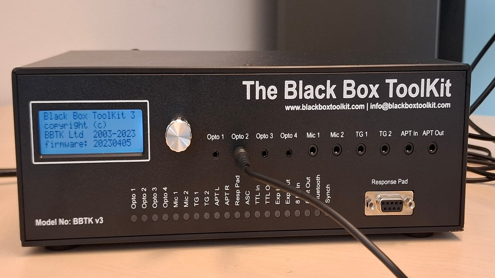

Automated capture of events with a Black Box ToolKit(tm) 
========================================================

The [Black Box ToolKit](https://www.blackboxtoolkit.com/bbtkv3.html)  is a device that allows psychologists to measure the timing of audio-visual stimuli with sub-millisecond accuracy. It replaces a digital oscilloscope, capturing activity on sound and visual sensors and TTL signals, and a signal generator,
 generating sounds or TTL signals.

This page describes `bbtk` a  program available at <https://github.com/chrplr/bbtkv3/releases>, that launches the acquisition of events on the Black Box ToolKit and export them to `.csv` files, without manual interventation. This streamlines the testing of time sensitive psychology experiments.

This program relies on a Go module, [`github.com/chrplr/bbtkv3`](https://github.com/chrplr/bbtkv3), which encapsulates a small subset of the commands documented in *The BBTKv2 API Guide* (in the future, possibly, we might implement more functions). This go module can be used to drive the BBTK from programs written in Go.


| :exclamation: This is a **Work In Progress**. |
|-----------------------------------------------|

The program may not work as advertised, the documentation may not be up to date, etc.  You can contribute by proposing improvements or reporting bugs either by contacting me (`<christophe@pallier.org>`) or by opening an issue on the [github repository](http://github.com/chrplr/bbtkv3).

# Principle of operation



To operate, three pieces of equipement are needed:

1. A stimulation device (typically a computer, but not necessarily) 
2. The bbtkv3 with input sensors (photodiodes, sound detectors, TTL detectors) attached to the stimulation device.
3. A host computer driving the bbtkv2 (hooked to it via a USB cable).

| :point_up:  The stimulation PC and the host PC *can* be the same computer |
|---------------------------------------------------------------------------| 

As data are recorded asynchronously by the BBTKvr3, it is possible for a single PC to switch the BBTKv2 into “capture mode”, launch the stimulation program and, when done, download the timing data from the BBTKv3 memory.


# Running bbtk

Open a terminal (e.g. start `cmd` under Windows), and type:

```bash
bbtk
``` 

This should launch a 30s acquisition. 


`bbtk -h` will display the usage, e.g.:


```
Usage of bbtk:
  -D	Debug mode
  -V	Display version
  -b int
    	baudrate (speed in bps) (default 115200)
  -d int
    	duration of capture (in s) (default 30)
  -o string
    	output file name for captured data (default "bbtk-capture.dat")
  -p string
    	device (serial port name) (default "/dev/ttyUSB0")
```

> [!NOTE]
>  Another program, `bbtk-adjust-thresholds` allows you the set the sensors' thresholds before doing the capture.


# Installation

Compiled versions for MACOSX, Windows and Linux, and intel (amd64) or arm are avavailable in <https://github.com/chrplr/bbtkv3/releases>.

Get the version for your OS and architecture, and copy it in any folder listed in the `PATH` variable of your OS (e.g. `%windir%/system32` for Windows)


# Troubleshooting

> [!WARNING]
> The BBTK and the host PC communicate via a serial protocol over
USB. Depending on your computer, you may need to install an additional drivers to handle this. 

   
| :zap: Windows |
|---------------|

To determine the (virtual) serial port to which the BBTK is attached, check the "Ports (COM & LPT)" section of the Computer Management console.

For the BBTK v2, you may need to install a driver to communicate with the BBTK. You can install the mbed-cli available from <https://os.mbed.com/docs/mbed-os/v6.16/quick-start/build-with-mbed-cli.html> and check install driver during the setup.

For the BBTK v3, you may need to install the <https://ftdichip.com/drivers/vcp-drivers/> following instructions at <https://ftdichip.com/document/installation-guides/>


| :zap: Linux  |
|--------------|


For the BBTK to be recognized as a serial device, the module `ftdi_sio` must be loaded in the linux kernel. To do so manually:

    sudo modprobe ftdi_sio

To determine which serial port the BBTK is attached toi (`/dev/ttyACM0`, `/dev/ttyUSB0`, ...), run: 

    sudo dmesg -w 

| :zap: MacOS X |
|---------------|

The BBTK may appear as `/dev/cu.usbserial-BBTKXXXX`. The page at <https://ftdichip.com/drivers/vcp-drivers/> contains drivers for various MacOS X versions.


# Compiling from source

The source code is available at <https://github.com/chrplr/bbtkv3>

To build the executable, you need the [Go development tools](https://go.dev/) (and [Git](https://git-scm.com/downloads) if you want to clone the github repository rather than downloading the src as a zip file)


```
git clone https://github.com/chrplr/bbtkv3.git
cd bbtkv3  
go build ./... 
```

This should generate the `bbtk` executable in the folder `cmd/bbtk`

For cross-compiling:

```bash
./build.sh
```

The outcome is in `binaries/`

---

AUTHOR: christophe@pallier.org

LICENSE: GPL-3.0
