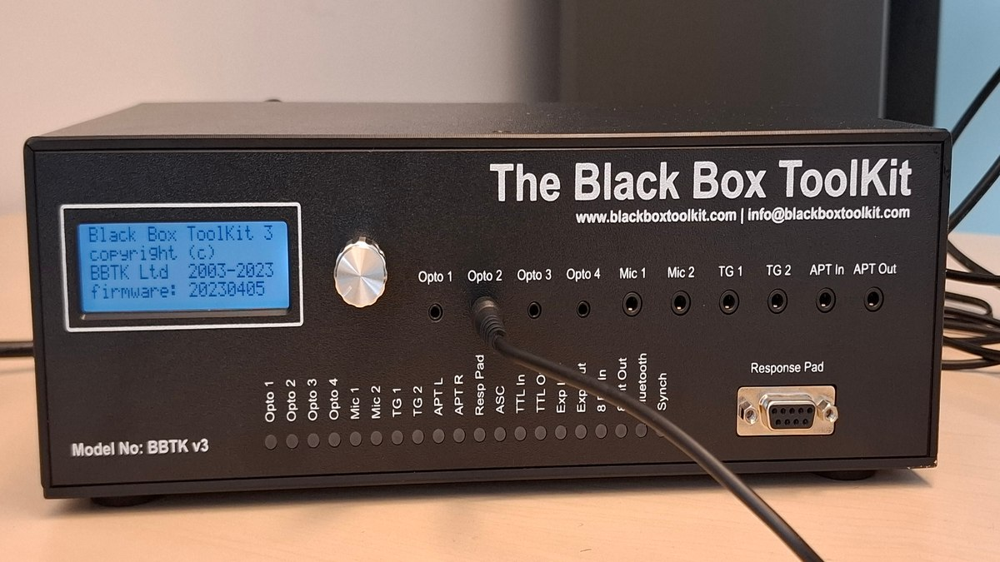

Command-line interface for the Black Box ToolKit v3
===================================================

[](https://doi.org/10.5281/zenodo.19551604)

The [Black Box ToolKit](https://www.blackboxtoolkit.com/bbtkv3.html)  is a device that allows psychologists to measure the timing of audio-visual stimuli with sub-millisecond accuracy. It replaces a digital oscilloscope, capturing activity on sound and visual sensors and TTL signals, and a signal generator,
 generating sounds or TTL signals.

This page describes a set of command-line tools that streamline the testing of time-critical psychology experiments:

| Tool | Description |
|------|-------------|
| `bbtk-detect-port` | Scans serial ports to locate the connected BBTK |
| `bbtk-capture` | Captures events for a given duration and exports them to `.dat`, `-dscevents.csv`, and `-events.csv` files |
| `bbtk-input-check` | Streams live input state from the device (ICHK); press `Esc` to stop |
| `bbtk-event-marking` | Configures and runs the command-event marking program on the device; press `Esc` to stop |
| `bbtk-adjust-thresholds` | Opens the interactive sensor threshold adjustment menu on the device |
| `bbtk-get-thresholds` | Reads and prints the current sensor thresholds |
| `bbtk-set-thresholds` | Writes eight threshold values to the device |
| `bbtk-set-smoothing` | Configures sensor smoothing |
| `bbtk-send-command` | Reads raw protocol commands from stdin, sends each to the BBTK, and prints responses to stdout |
| `get-serial-port-list` | Lists all available serial ports on the host machine |
| `ibbtk` | Interactive menu-driven shell — keeps a persistent connection and exposes all of the above in a nested menu |
| `events-stats` | Computes descriptive statistics, ASCII histograms, and a Markdown report with PNG histogram and timeline plots from the `-events.csv` files produced by `bbtk-capture` |


A [paper](https://github.com/chrplr/bbtkv3/blob/main/paper/bbtkv3-paper.pdf) describes these tools. 

Binaries for different operating systems are available at <https://github.com/chrplr/bbtkv3/releases>,

The source code (under a GPL-3.0 License) is at <https://github.com/chrplr/bbtkv3>. Instructions for compilation are provided below.

This program relies on a Go module, `github.com/chrplr/bbtkv3`, which encapsulates a small subset of the commands documented in *The BBTKv2 API Guide* (in the future, we might implement more functions). This go module can be used to drive the BBTK from programs written in Go.


# Principle of operation



To operate, three pieces of equipement are needed:

1. A stimulation device (typically a computer, but not necessarily) 
2. The BBTK with input sensors (photodiodes, sound detectors, TTL detectors) linked to the stimulation device.
3. A host computer driving the BBTK (linked to it via a USB cable).

| :point_up:  The stimulation PC and the host PC *can* be the same computer |
|---------------------------------------------------------------------------| 

As data are recorded asynchronously by the BBTKv3, it is possible for a single PC to switch the BBTKv3 into “capture mode”, launch the stimulation program and, when done, download the timing data from the BBTKv3 memory.


# Usage

The tools are meant to be ran on the command line. You must therefore open a Terminal to execute them (e.g., under Windows, start `cmd` or `Powershell`). 

Provided the tools are in the PATH (see below), you can just type:

```bash
$ bbtk-detect-port
BBTK found at  COM4
$ bbtk-adjust-thresholds -p COM4
$ bbtk-capture -p COM4 -d 120 session1
... 
``` 

To launch a 2-min acquisition with output files named `session1-001.dat`, `session1-001-dscevents.csv`, and `session1-001-events.csv`.
The sequence number is incremented automatically (`-001`, `-002`, …) so previous recordings are never overwritten.


```bash
bbtk-capture -h
```
 will yield some help:

```
Usage: bbtk-capture [options] <basefilename>

Options:
  -D	Debug mode
  -V	Display version
  -b int
    	baudrate (speed in bps) (default 115200)
  -d int
    	duration of capture (in s) (default 30)
  -no-countdown
    	Disable second-by-second countdown display
  -p string
    	device (serial port name); overrides BBTK_PORT (default "/dev/ttyUSB0")

Output files: <basefilename>-001.dat, <basefilename>-001-dscevents.csv, <basefilename>-001-events.csv
Sequence number is incremented automatically to avoid overwriting previous recordings.
```

## Driving a capture from a script

`bbtk-capture` prints a line on stdout, on its own line, at the exact moment the
device starts recording:

```
BBTK-CAPTURE-READY duration=120
```

This is the synchronisation point for running a stimulus program alongside the
capture on the same machine. Nothing earlier in the output identifies that
instant: the `Capturing events (with DSCM) for N seconds...` message is printed
roughly 5.7 s **before** recording begins, because the `DSCM` / `TIML` / duration
/ `RUDS` sequence and its pacing sleeps still have to run.

Startup takes 11–40 s in total — a fixed floor of command pacing, plus an
internal-memory erase whose duration depends on whether the box needs a full
format (`FRMT;`) or only an erase of used sectors (`ESEC;`). That variability is
why a script must wait for the marker rather than sleeping a fixed amount.

A minimal wrapper:

```bash
bbtk-capture -d 120 -no-countdown session1 </dev/null >capture.log 2>&1 &
BBTK_PID=$!
until grep -q BBTK-CAPTURE-READY capture.log; do
    kill -0 $BBTK_PID 2>/dev/null || { echo "capture died"; exit 1; }
    sleep 1
done
./my-stimulus-program          # runs inside the capture window
wait $BBTK_PID                 # files are written when bbtk-capture exits
```

Redirect stdin from `/dev/null`. `bbtk-capture` puts the terminal into raw mode
to watch for Esc, and that terminal is shared with the stimulus program; with
stdin closed the raw-mode call fails harmlessly and the stimulus keeps its own
input handling.

`tests/Timing-Tests/run-timing-tests.sh` in the
[goxpyriment](https://github.com/chrplr/goxpyriment) repository implements this,
gated behind `BBTK_CAPTURE=1`.

## Interrupting a capture

`bbtk-capture` traps `SIGINT` (Ctrl-C) and `SIGTERM`. On either it stops the
capture, asks the device for what it recorded, and writes the usual three output
files from that — a truncated recording rather than none. The end-of-capture
timestamp reflects the time actually recorded, not the `-d` value, so events
still active at the stop are not reported with inflated durations.

Recovery is best-effort: it waits up to 10 s for the device to return its buffer
after the break. If nothing arrives, it says so and exits non-zero rather than
pretending the run succeeded — the recording is then still in the device's RAM
and will be cleared by the next capture. A second Ctrl-C force-quits.

Pressing Esc during a capture does the same thing (only when stdin is a
terminal).

## Selecting the serial port

Every tool that talks to the device accepts `-p`. If you omit it, the port is read
from the `BBTK_PORT` environment variable, so you can set it once per session:

```bash
export BBTK_PORT=/dev/ttyUSB0          # Linux
export BBTK_PORT=/dev/cu.usbserial-BBTKXXXX  # macOS
set BBTK_PORT=COM4                     # Windows (cmd)
```

`-p` always takes precedence over `BBTK_PORT`. When neither is given,
`bbtk-capture`, `bbtk-get-thresholds`, `bbtk-set-thresholds`,
`bbtk-adjust-thresholds` and `bbtk-set-smoothing` fall back to `/dev/ttyUSB0`,
while `ibbtk`, `bbtk-send-command`, `bbtk-input-check` and `bbtk-event-marking`
stop with an error.

During the countdown, press `Esc` (no Enter needed) to abort the capture early. The program sends a stop command to the device and exits cleanly.


# Installation

Compiled versions for MACOSX, Windows and Linux, and intel (amd64) or arm are available at <https://github.com/chrplr/bbtkv3/releases>.

Each release provides one zip archive per platform, named `bbtkv3-{os}-{arch}-{version}.zip`, containing all the tools. Download the archive for your OS and architecture and unzip it — for example:

```bash
unzip bbtkv3-linux-amd64-v1.0.13.zip
```

Inside, each binary is named `{tool}-{os}-{arch}-{version}`. Rename them to your liking (I would strip the `-OS-ARCH-VERSION` suffix), and copy them to some folder listed in the `PATH` variable of your OS. In the examples below, replace the version number with the one you downloaded.

| :zap: Windows |
|---------------|

In the command line terminal application, CMD, type:

```bash
cd Downloads

rem rename the executables
ren bbtk-capture-windows-amd64-v1.0.13.exe  bbtk-capture.exe
ren bbtk-adjust-thresholds-windows-amd64-v1.0.13.exe  bbtk-adjust-thresholds.exe
```

Then copy the new`*.exe` files into a folder, say /home/user/bin, and add this folder to the system's PATH environment variable (see <https://www.eukhost.com/kb/how-to-add-to-the-path-on-windows-10-and-windows-11/>).

Now , when you launch CMd, you should be able to execute any of these program by typing its name and pressing 'Enter'.


| :zap: MacOS X |
|---------------|

Assuming that you downloaded the programs in `~/Downloads` and want to install them in `~/bin`:


```zsh
mkdir -p ~/bin
cd ~/Downloads
for f in bbtk-* ibbtk-* events-stats-* get-serial-port-list-*; do
    chmod +x "$f"
    mv "$f" ~/bin/"$(echo "$f" | sed -E 's/-(darwin|linux|windows)-(amd64|arm64)-v?[0-9.]+$//')"
done
```

(the `sed` expression strips the `-OS-ARCH-VERSION` suffix, whatever the version)


| :zap: Linux |
|-------------|

Make sure that you are part of the `dialout` group. 

```
sudo usermod -a -G dialout $USER
```

Assuming that you downloaded the programs in `~/Downloads` and want to install them in `~/bin`:

```bash
mkdir -p ~/bin
cd ~/Downloads
for f in bbtk-* ibbtk-* events-stats-* get-serial-port-list-*; do
    chmod +x "$f"
    mv "$f" ~/bin/"$(echo "$f" | sed -E 's/-(darwin|linux|windows)-(amd64|arm64)-v?[0-9.]+$//')"
done

#run
bbtk-detect-port
bbtk-capture -p /dev/ttyACM0 -d 30 session1
```
# ibbtk — interactive shell

`ibbtk` is an interactive menu-driven shell for communicating with the BBTKv3. Rather than running separate commands, it keeps a persistent connection open and lets you issue commands one by one.

## Starting ibbtk

```bash
ibbtk -p /dev/ttyUSB0        # Linux
ibbtk -p COM4                 # Windows
ibbtk -p /dev/cu.usbserial-BBTKXXXX   # macOS
```

The port can also be set via the `BBTK_PORT` environment variable, in which case `-p` can be omitted.

```
Options:
  -p string   serial port (or set BBTK_PORT)
  -b int      baudrate (default 115200)
  -v          verbose connection output
  -V          display version and exit
```

## Command structure

Once connected, `ibbtk` presents a prompt. Type `menu` at any prompt to list available commands, and `exit` to leave the current level (or quit the program from the top level).

### Top-level commands

| Command | Description |
|---------|-------------|
| `status` | Check whether the device is alive and show firmware version |
| `info` | Display copyright/firmware info on the device LCD |
| `thresholds` | Enter the thresholds sub-menu |
| `smoothing` | Enter the smoothing sub-menu |
| `capture` | Enter the capture sub-menu |
| `inputcheck` | Send `ICHK` and stream input-state lines (type `X` + Enter to stop) |
| `outputcheck` | Send `OCHK` and stream output-state lines (type `X` + Enter to stop) |
| `flush` | Flush the serial output buffer |
| `reset` | Reset serial input/output buffers |
| `raw <CMD>` | Send a raw protocol command and print all response lines (stops after 1 s of silence) |
| `reconnect` | Purge serial buffers and re-issue `CONN` — use this to recover after a bad command desynchronises the dialog |
| `sendbreak` | Send the break character `X` to the device (interrupts ongoing operations) |

### `thresholds` sub-menu

| Command | Description |
|---------|-------------|
| `get` | Read the current thresholds from the device |
| `set <values>` | Set all eight thresholds, e.g. `set 63,63,32,32,100,100,100,100` (Mic1, Mic2, Sounder1, Sounder2, Opto1–4; range 0–127) |
| `adjust` | Launch the interactive threshold adjustment procedure on the device |

### `smoothing` sub-menu

| Command | Description |
|---------|-------------|
| `set <mask>` | Set the smoothing mask, e.g. `set 1;1;0;0;1;1` (fields: Mic1;Mic2;Opto4;Opto3;Opto2;Opto1) |
| `default` | Enable smoothing on all sensors |

Beware: When smoothing is on for a given input line, one must subtract 20ms to durations reported by the bbtk for this input line.

### `capture` sub-menu

| Command | Description |
|---------|-------------|
| `run <seconds> [output.dat]` | Clear device memory, capture for the given duration, and save `.dat`, `-dscevents.csv`, and `-events.csv` files (default output name: `ibbtk-capture.dat`) |
| `clear` | Erase the device timing memory |

## Example session

```
$ ibbtk -p /dev/ttyUSB0
Connected to BBTKv3. Type 'menu' for commands, 'exit' to quit.
ibbtk> status
BBTKv3 is alive
Firmware: 3.14
ibbtk> thresholds
thresholds> get
{Mic1:63 Mic2:63 Sounder1:32 Sounder2:32 Opto1:100 Opto2:100 Opto3:100 Opto4:100}
thresholds> set 63,63,32,32,80,80,80,80
Thresholds now: {Mic1:63 Mic2:63 Sounder1:32 Sounder2:32 Opto1:80 Opto2:80 Opto3:80 Opto4:80}
thresholds> exit
Exiting...
ibbtk> capture
capture> run 30 myexp.dat
Clearing timing data... ok
Capturing for 30 seconds...
Raw data saved to myexp.dat
DSC events saved to myexp-dscevents.csv
Events saved to myexp-events.csv (12 events detected)
capture> exit
Exiting...
ibbtk> exit
Exiting...
```

# bbtk-input-check — stream live input state

`bbtk-input-check` sends the `ICHK` command to the device and continuously prints every line returned, showing the state of the 12 input lines (Keypad1–4, Opto1–4, TTLin1–2, Mic1–2) in real time. Press `Esc` (no Enter needed) to stop; the program sends the break character to the device and exits.

```
Options:
  -p string   serial port (or set BBTK_PORT)
  -b int      baudrate (default 115200)
  -V          display version and exit
```

## Example

```bash
$ bbtk-input-check -p /dev/ttyUSB0
Streaming input state. Press Esc to stop.
000000000000;
000000010000;
000000000000;
000000010000;
Stopping...
```

Each line is a 12-bit snapshot of the input ports, terminated with `;`. A `1` in a position means that sensor is currently active.

# bbtk-event-marking — run the command-event marking program

`bbtk-event-marking` programs the BBTK to operate in event-marking mode: it sends the `PDCE / STYP / PATT / TIML` setup sequence together with the pattern table, commits with `PCCR`, and starts execution with `RUEM`. The device then runs indefinitely, marking command events as they occur. Press `Esc` (no Enter needed) to stop; the program sends the break character to the device and exits.

A one-second pause is inserted before each protocol command (matching the timing used by `bbtk-capture`) to give the device time to process each step.

```
Options:
  -p string   serial port (or set BBTK_PORT)
  -b int      baudrate (default 115200)
  -V          display version and exit
```

# bbtk-send-command — pipe raw commands to the device

`bbtk-send-command` reads commands from stdin (one per line), sends each to the BBTK as a raw protocol command, and prints the device's responses to stdout. No handshake is performed automatically, so you have full control over the command sequence.

```
Options:
  -p string   serial port (or set BBTK_PORT)
  -b int      baudrate (default 115200)
  -timeout int  seconds of silence after last response line before moving to
                the next command (default 1)
  -V          display version and exit
```

## Examples

```bash
# Check that the device echoes back
echo "ECHO" | bbtk-send-command -p /dev/ttyUSB0

# Full handshake then query firmware version
printf "CONN\nFIRM\n" | bbtk-send-command -p /dev/ttyUSB0

# Use the BBTK_PORT environment variable
printf "CONN\nECHO\n" | BBTK_PORT=/dev/ttyUSB0 bbtk-send-command -timeout 2
```

After sending each command the tool waits up to `-timeout` seconds for the device to stop replying before sending the next command. Increase `-timeout` for commands that trigger longer device operations.

# events-stats — descriptive statistics on captured events

`events-stats` reads one or more `-events.csv` files produced by `bbtk-capture` and prints three blocks of statistics to stdout, each followed by an ASCII histogram. It also writes a Markdown report *and* an HTML report (by default, named after the input file) with publication-quality PNG figures. Use `-no-md` / `-no-html` to skip either one.

The three blocks are:

1. **Duration statistics** — distribution of event durations for each sensor channel.
2. **Inter-onset interval (jitter) statistics** — distribution of the time between successive events of the same type, measuring stimulus regularity.
3. **Paired-event onset differences** — for each occurrence of the reference event type (`-event1`, default `TTLin1`), the tool finds the nearest following event of every other type and reports the distribution of those onset differences. This is the main measure of latency: how long after a TTL trigger was the corresponding visual or audio event actually detected by the sensor.

All time values are in milliseconds.

## Usage

```
events-stats [-event1 TYPE] [-detect-outliers MS] [-no-md] file1-events.csv [file2-events.csv ...]
```

Multiple files are pooled before computing statistics, which is useful when you have repeated capture sessions.

## Options

| Flag | Default | Description |
|------|---------|-------------|
| `-event1 TYPE` | `TTLin1` | Reference event type; onset differences are reported for every other event type relative to this one |
| `-detect-outliers MS` | `50` | Exclude data points more than MS milliseconds from the median (set to `0` to disable) |
| `-no-md` | off | Skip writing the Markdown report |
| `-no-html` | off | Skip writing the HTML report |
| `-V` | off | Print version and build, then exit |

## Markdown report

By default the tool writes `<basename>.md` alongside the input CSV, where `<basename>` is the input filename with `-events.csv` stripped. All PNG figures are saved in the same directory with the same prefix.

The report contains:

- Percentile tables for Duration, Jitter, and paired-event onset differences.
- **Log-scale histograms** (log₁₀ Y axis) for each distribution — rare outlier bins remain visible even when the main peak is thousands of times taller.
- **Timeline scatter plots** for each event type: Duration vs. onset time and SOA vs. onset time, drawn as stick plots (vertical bars from y = 0) so isolated outliers stand out clearly.

## Output format

Each statistics table has the following columns:

| Column | Description |
|--------|-------------|
| `Type` | Event type (sensor channel name) |
| `N` | Number of data points (after outlier removal) |
| `Min` / `P5` … `P95` / `Max` | Selected percentiles |
| `Range` | Max − Min |
| `P95-P05` | 90 % central interval |
| `Mean` | Sample mean |
| `SD` | Sample standard deviation (Bessel-corrected) |

Below each table, a 10-bin ASCII histogram is printed per event type. If outliers were removed, a warning of the form

```
Warning: N outliers detected in TYPE (> D.DDD ms away from the median): V1, V2, ...
```

is printed before the histograms.

## Example

```
$ events-stats -event1 TTLin1 -detect-outliers 10 session1-events.csv

=== Duration Statistics (ms) ===

Type    N     Min   P5    P25   P50   P75   P95   Max   Range  P95-P05  Mean  SD
TTLin1  5999  5.5   21.5  21.8  21.8  22.0  22.2  54.5  49.0   0.8      21.9  0.58
Opto1   6000  25.0  26.5  27.0  27.2  27.8  28.0  62.5  37.5   1.5      27.3  0.87

=== Inter-Onset Interval / Jitter Statistics (ms) ===

...

=== Paired-Event Onset Differences relative to TTLin1 (ms) ===

Type          N     Min   P5    P50   P95   Max   Range  P95-P05  Mean  SD
TTLin1→Opto1  5998  15.8  16.2  16.8  20.3  60.8  45.0   4.0      17.2  1.69

markdown report written to session1.md
```

## Pairing algorithm

For each `event1` occurrence (sorted by onset time), `events-stats` locates the **nearest following** event of each other type using binary search. Multiple `event1` events can pair with the same target event (non-exclusive), handling cases where two triggers fire before the sensor responds.

## Typical workflow

```bash
# 1. Record events
bbtk-capture -p /dev/ttyUSB0 -d 60 session1

# 2. Compute statistics and generate the Markdown report
events-stats session1-events.csv

# 3. Use Mic1 as the reference instead of TTLin1
events-stats -event1 Mic1 session1-events.csv

# 4. Pool several sessions
events-stats session1-events.csv session2-events.csv session3-events.csv

# 5. Stdout only, no report files
events-stats -no-md session1-events.csv
```

# Troubleshooting

> [!WARNING]
> The BBTK and the host PC communicate via a serial protocol over
USB. Depending on your computer, you may need to install an additional drivers to handle this. 

   
| :zap: Windows |
|---------------|

To determine the (virtual) serial port to which the BBTK is attached, check the "Ports (COM & LPT)" section of the Computer Management console.

For the BBTK v2, you may need to install a driver to communicate with the BBTK. You can install the mbed-cli available from <https://os.mbed.com/docs/mbed-os/v6.16/quick-start/build-with-mbed-cli.html> and check install driver during the setup.

For the BBTK v3, you may need to install the <https://ftdichip.com/drivers/vcp-drivers/> following instructions at <https://ftdichip.com/document/installation-guides/>


| :zap: Linux  |
|--------------|


For the BBTK to be recognized as a serial device, the module `ftdi_sio` must be loaded in the linux kernel. To do so manually:

    sudo modprobe ftdi_sio

To determine which serial port the BBTK is attached toi (`/dev/ttyACM0`, `/dev/ttyUSB0`, ...), run: 

    sudo dmesg -w 

| :zap: MacOS X |
|---------------|

The BBTK may appear as `/dev/cu.usbserial-BBTKXXXX`. The page at <https://ftdichip.com/drivers/vcp-drivers/> contains drivers for various MacOS X versions.


## The tools cannot reach the BBTK: suspect the USB cable

> [!IMPORTANT]
> A failing USB cable does not look like a failing cable. The device still
> enumerates far enough for the kernel to create `/dev/ttyUSB0` and bind
> `ftdi_sio`, so it *appears* connected, and the fault is easily mistaken
> for a bug in these tools.

The cable supplied with our BBTK v3 failed this way. Replacing it with a
standard USB-B printer cable fixed it. The symptoms were:

- `sudo dmesg` reports `-32` errors (`-EPIPE`, a USB endpoint stall):

      ftdi_sio ttyUSB0: failed to get modem status: -32
      ftdi_sio ttyUSB0: usb_serial_generic_read_bulk_callback - urb stopped: -32

- `/dev/ttyUSB0` exists and `ftdi_sio` is bound, so the device looks present;
- `bbtk-detect-port` finds nothing, and writes to the port get no reply;
- on Linux, `manufacturer`, `product` and `serial` are **missing** from
  `/sys/bus/usb/devices/<dev>/`.

That last point is the reliable tell: enumeration got through the device and
configuration descriptors and then stalled. There was enough signal integrity
to start enumerating, but not enough to finish.

On Linux, `tools/ftdi-check.sh` performs these checks and prints a verdict:

    ./tools/ftdi-check.sh              # or: ./tools/ftdi-check.sh /dev/ttyUSB1

It exits 0 when the USB link is healthy — in which case the problem lies at the
device or protocol level and debugging the tools is worthwhile — and 1 when the
link itself is at fault, in which case **swap the USB cable before debugging
anything else**, then try a port that is not behind a dock or a hub.


# Compiling from source

You need the [Go development tools](https://go.dev/).

To install all the tools at once, use the `...` wildcard:

```
go install github.com/chrplr/bbtkv3/cmd/...@latest
```

The binaries are placed in `$(go env GOPATH)/bin`, which must be in your `PATH`.

Alternatively, if you prefer, you can download the github repo  <https://github.com/chrplr/bbtkv3>
 using [git](https://git-scm.com/downloads) and build the binaries:

```
git clone https://github.com/chrplr/bbtkv3.git
cd bbtkv3  
make build
```

This will generate executables in `_build/`.

For cross-compiling:

```bash
make dist
```

This builds every tool for darwin/linux/windows × amd64/arm64 and packages them into `binaries/bbtkv3-{os}-{arch}-{version}.zip`. The version is taken from the latest git tag; override it with `make dist VERSION=v1.2.3`.

> [!NOTE]
> You can set `PLATFORMS` and `ARCHS` to target a subset of OS and ARCH, e.g.:

```bash
make dist PLATFORMS=linux ARCHS=amd64
```

## Releasing

Pushing a tag that starts with `v` triggers the GitHub Actions workflow in `.github/workflows/release.yml`, which runs the tests, builds the six zips and publishes them as a GitHub release:

```bash
git tag v1.2.3
git push origin v1.2.3
```

---

# AUTHORSHIP & LICENSE

AUTHOR: Christophe Pallier <christophe@pallier.org>

LICENSE: GPL-3.0

If you use this software, please cite it as:

> Pallier, C. (2026). *bbtkv3: An Open-Source Suite for Timing Measurement and Analysis with the Black Box ToolKit v3* [Computer software]. Zenodo. https://doi.org/10.5281/zenodo.19551604

Note: that DOI is the *concept* DOI: it always resolves to the most recent release. To cite the exact version you used, use its own DOI instead — for example
<https://doi.org/10.5281/zenodo.21620779> for v1.0.13. Every release has one, listed on the [Zenodo record](https://doi.org/10.5281/zenodo.19551604).

Machine-readable metadata is in [`CITATION.cff`](CITATION.cff); GitHub's *"Cite this repository"* button renders it in APA and BibTeX.


# REFERENCES

* Plant, R., Hammond, N., & Turner, G. (2004). Self-validating presentation and response timing in cognitive paradigms: How and why? Behavior Research Methods, Instruments, & Computers : A Journal of the Psychonomic Society, Inc, 36, 291–303. https://doi.org/10.3758/BF03195575
* Plant, R. (2016). The Black Box Toolkit v2. API Guide. Revision RC4.

