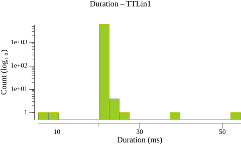
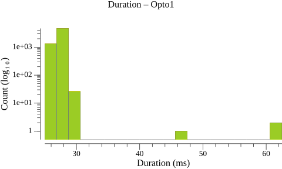
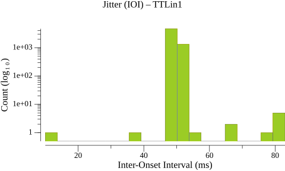
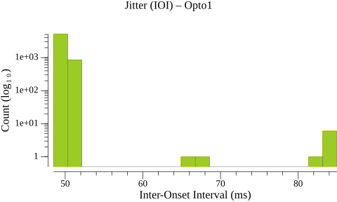
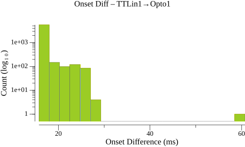
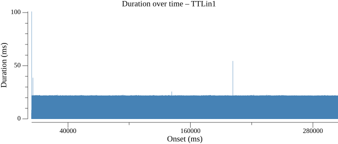
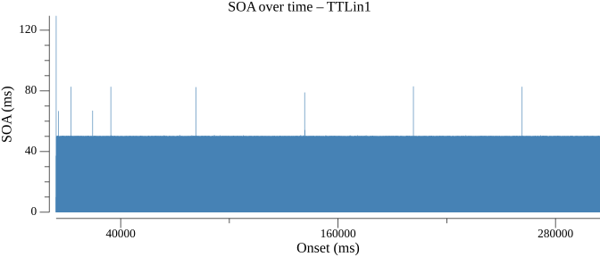
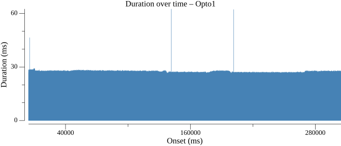
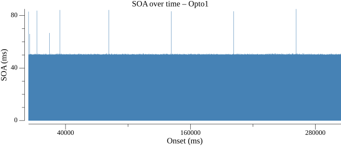

# Events Statistics Report

## Duration Statistics (ms)

| Type | N | Min | P5 | P25 | P50 | P75 | P95 | Max | Range | P95-P05 | Mean | SD |
| --- | --- | --- | --- | --- | --- | --- | --- | --- | --- | --- | --- | --- |
| TTLin1 | 5999 | 5.5 | 21.5 | 21.8 | 21.8 | 22.0 | 22.2 | 54.5 | 49.0 | 0.8 | 21.9 | 0.58 |
| Opto1 | 6000 | 25.0 | 26.5 | 27.0 | 27.2 | 27.8 | 28.0 | 62.5 | 37.5 | 1.5 | 27.3 | 0.87 |

### Duration Histograms

> **Warning:** 1 outlier(s) excluded from TTLin1 (> 50.000 ms from median)

## Inter-Onset Interval / Jitter Statistics (ms)

| Type | N | Min | P5 | P25 | P50 | P75 | P95 | Max | Range | P95-P05 | Mean | SD |
| --- | --- | --- | --- | --- | --- | --- | --- | --- | --- | --- | --- | --- |
| TTLin1 | 5998 | 10.0 | 49.8 | 50.0 | 50.0 | 50.0 | 50.2 | 83.0 | 73.0 | 0.5 | 50.0 | 1.21 |
| Opto1 | 5999 | 48.5 | 49.5 | 49.8 | 50.0 | 50.2 | 50.5 | 85.0 | 36.5 | 1.0 | 50.0 | 1.25 |

### Jitter Histograms

> **Warning:** 1 outlier(s) excluded from TTLin1 (> 50.000 ms from median)

## Paired-Event Onset Differences relative to TTLin1 (ms)

### Tables

| Type | N | Min | P5 | P25 | P50 | P75 | P95 | Max | Range | P95-P05 | Mean | SD |
| --- | --- | --- | --- | --- | --- | --- | --- | --- | --- | --- | --- | --- |
| TTLin1→Opto1 | 5998 | 15.8 | 16.2 | 16.5 | 16.8 | 17.2 | 20.3 | 60.8 | 45.0 | 4.0 | 17.2 | 1.69 |

### Paired-Event Histograms

> **Warning:** 2 outlier(s) excluded from TTLin1→Opto1 (> 50.000 ms from median)

## Timeline Plots

