# Events Statistics Report

## Duration Statistics (ms)

| Type | N | Min | P5 | P25 | P50 | P75 | P95 | Max | Range | P95-P05 | Mean | SD |
| --- | --- | --- | --- | --- | --- | --- | --- | --- | --- | --- | --- | --- |
| TTLin1 | 600 | 5.8 | 6.0 | 6.0 | 6.0 | 6.2 | 6.2 | 6.8 | 1.0 | 0.2 | 6.1 | 0.14 |
| Opto1 | 600 | 22.8 | 23.5 | 24.0 | 24.5 | 24.8 | 25.0 | 25.2 | 2.5 | 1.5 | 24.3 | 0.44 |
| Mic1 | 603 | 35.2 | 76.2 | 77.2 | 78.0 | 78.0 | 80.0 | 92.5 | 57.2 | 3.8 | 77.7 | 2.29 |

### Duration Histograms

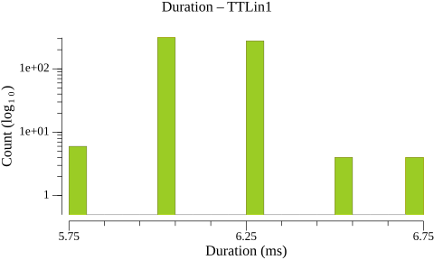

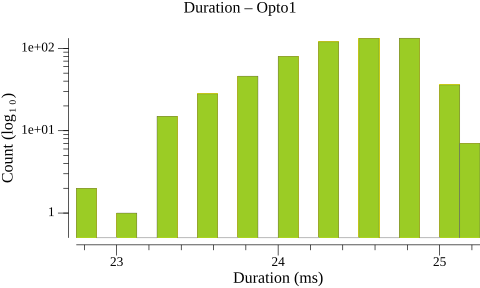

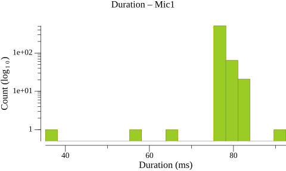

## Inter-Onset Interval / Jitter Statistics (ms)

| Type | N | Min | P5 | P25 | P50 | P75 | P95 | Max | Range | P95-P05 | Mean | SD |
| --- | --- | --- | --- | --- | --- | --- | --- | --- | --- | --- | --- | --- |
| TTLin1 | 599 | 476.5 | 478.8 | 479.0 | 479.0 | 479.2 | 479.2 | 479.5 | 3.0 | 0.5 | 479.0 | 0.23 |
| Opto1 | 599 | 451.2 | 465.2 | 467.5 | 482.2 | 483.9 | 498.5 | 501.5 | 50.2 | 33.2 | 479.0 | 9.59 |
| Mic1 | 598 | 473.0 | 476.0 | 476.0 | 481.8 | 481.8 | 482.0 | 482.2 | 9.2 | 6.0 | 479.0 | 2.91 |

### Jitter Histograms

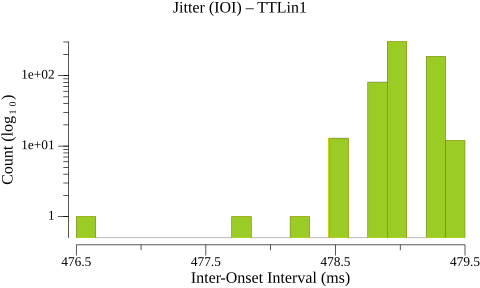

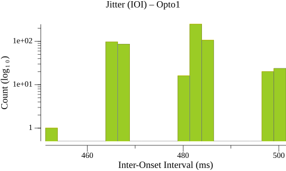

> **Warning:** 4 outlier(s) excluded from Mic1 (> 50.000 ms from median)

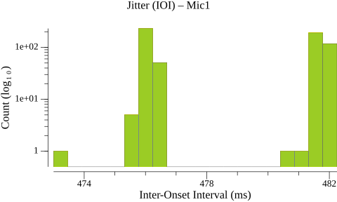

## Paired-Event Onset Differences relative to TTLin1 (ms)

### Tables

| Type | N | Min | P5 | P25 | P50 | P75 | P95 | Max | Range | P95-P05 | Mean | SD |
| --- | --- | --- | --- | --- | --- | --- | --- | --- | --- | --- | --- | --- |
| TTLin1→Opto1 | 600 | 46.5 | 50.5 | 56.8 | 61.5 | 66.2 | 72.8 | 77.5 | 31.0 | 22.3 | 61.4 | 6.67 |

| Type | N | Min | P5 | P25 | P50 | P75 | P95 | Max | Range | P95-P05 | Mean | SD |
| --- | --- | --- | --- | --- | --- | --- | --- | --- | --- | --- | --- | --- |
| TTLin1→Mic1 | 600 | 53.2 | 54.5 | 56.0 | 57.5 | 59.0 | 60.5 | 61.8 | 8.5 | 6.0 | 57.5 | 1.89 |

### Paired-Event Histograms

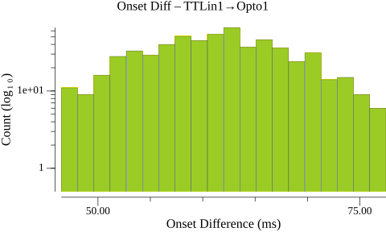

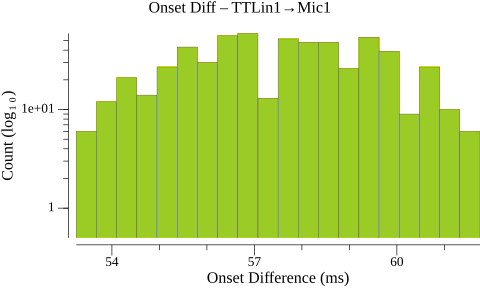

## Timeline Plots

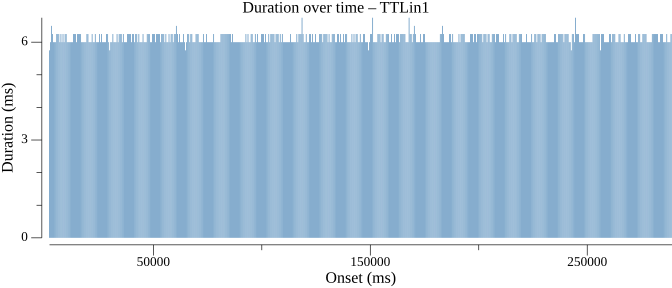

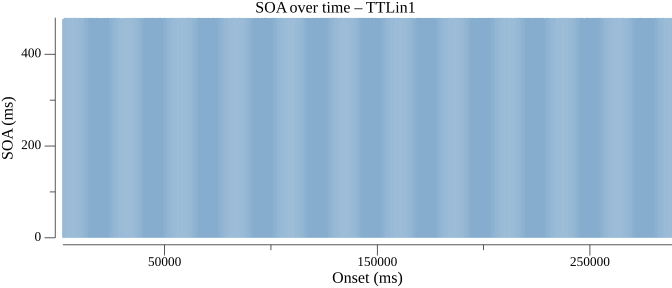

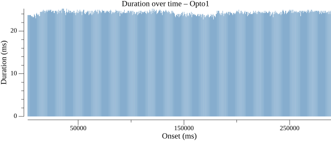

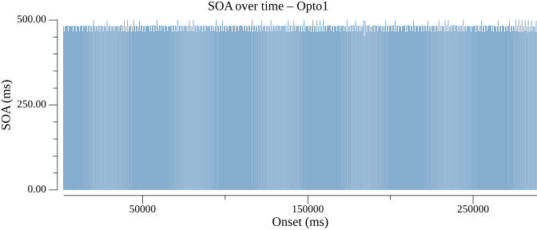

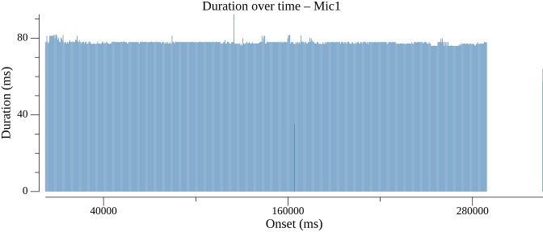

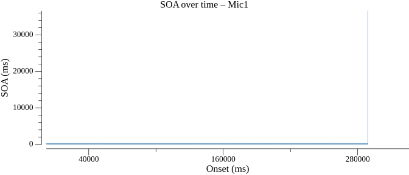

